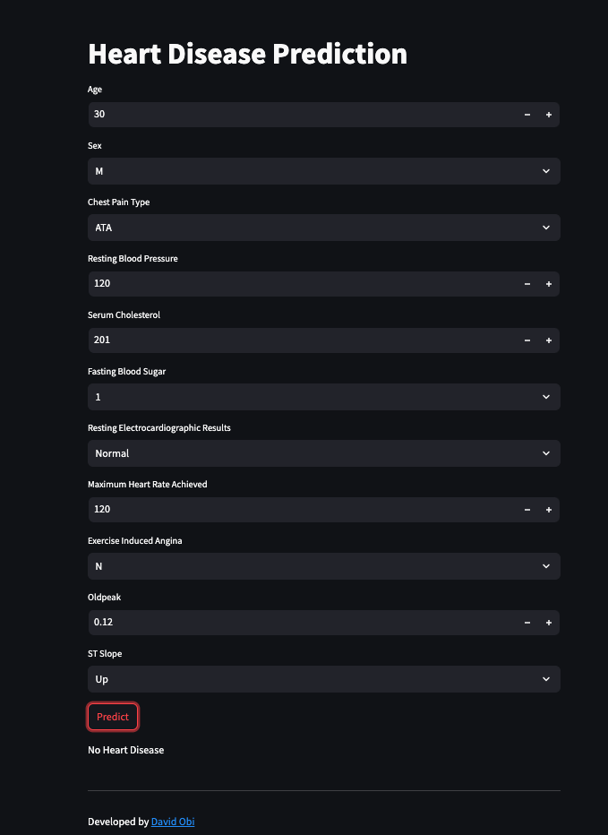

# Heart Disease Prediction Using Machine Learning

## Project Overview
This project develops a machine learning model to predict the likelihood of heart disease in patients based on various health metrics. Built with Python and deployed using Flask, this application is designed for ease of use by healthcare professionals, enabling them to make data-driven predictions on heart disease risk

## Project Workflow

1. **Collect the Data**: Gather comprehensive patient health data, including key metrics associated with heart disease, to form the dataset for model training.

2. **Import Libraries and Load the Data**: Use essential libraries such as Pandas, NumPy, and Scikit-learn for efficient data loading and manipulation.

3. **Preprocess the Data**: Ensure data quality by handling missing values, outliers, and other inconsistencies to maintain high prediction accuracy.

3. **Feature Engineering*: Identify and create impactful features that enhance the model's ability to detect patterns associated with heart disease.

4. **Model Creation**: Train various machine learning models for heart disease prediction and use cross-validation techniques to evaluate and select the best-performing model.

5. **Save the Best Model**: Utilize libraries like joblib or pickle to save the most accurate model, making it accessible for deployment.

6. **Deployment**: Deploy the selected model via a Flask application, setting up a web server that enables healthcare professionals to interact with the model through a user-friendly interface.

7. **Develop a Flask App**:
    - Build and integrate the saved model within a Flask app to facilitate predictions on new patient data.
    - Launch the application to allow real-time predictions and interaction with users, providing an intuitive tool for healthcare settings.

## Key Features
**User-Friendly Interface**: A streamlined web application allows healthcare professionals to input patient data and obtain heart disease predictions instantly.
**Scalability**: The model is designed for easy deployment to cloud platforms, enabling widespread access.
**Early Diagnostics**: This tool supports early detection of heart disease, promoting timely interventions and potentially improving patient outcomes.

## Getting Started
1. Clone the Repository:
 ```bash
   git clone <repository-url>
   cd heart-disease-prediction
   ```

2. Install required packages:
   ```bash
   pip install -r requirements.txt
   ```

3. Run the Flask application:
   ```bash
   python app.py
   ```
   
4. Access the Application: Open a web browser and navigate to `http://localhost:5000` to start using the tool.

Output Screen: The output screen will display results as shown below.

## Conclusion
This project illustrates the development and deployment of a machine learning model for predicting heart disease, optimized for healthcare professionals. Through robust data preprocessing, model training, and integration into a Flask-based web application, this project offers a practical and accessible solution for early diagnostics.
